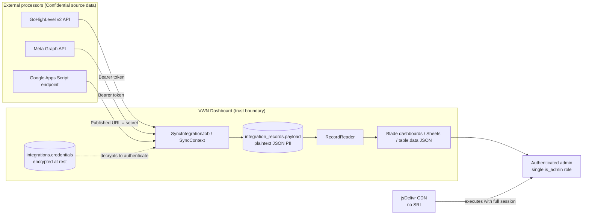

# VWN Dashboard — Security & Data Safety Assessment

| | |
|---|---|
| **System** | VWN Dashboard — Laravel 13 BI/reporting app over GoHighLevel, Meta Ads and Google Sheets |
| **Reviewed commit** | `8970f88` (branch `main`) |
| **Date** | 2026-08-31 |
| **Method** | Manual white-box code review (source, routes, config, migrations, git history). No dynamic testing, no infrastructure or cloud review. |
| **Stack** | PHP 8.3, Laravel 13.19, Blade + Tailwind + vanilla JS, SQLite (default) / MySQL, database queue + scheduler |
| **Classification of data handled** | Confidential — third-party personal data (CRM contacts: names, emails, phone numbers, companies, deal values) plus API credentials for three external platforms |

---

## 1. Executive summary

VWN Dashboard pulls CRM, advertising and spreadsheet data into a local store and renders it
as dashboards, metrics and a read-only spreadsheet workspace. The framework-level hygiene is
good: no SQL string concatenation anywhere, no unescaped Blade output, no shell execution,
CSRF on by default, bcrypt (cost 12) password hashing, throttled login, and — notably —
**integration credentials are encrypted at rest** (`'credentials' => 'encrypted:array'`).
Invitation tokens are correctly designed: 64 characters of randomness, SHA-256 hashed in the
database, single-use, 14-day expiry.

The risk is not in *how* code is written; it is in **who is allowed to see what**, and in
**how the personal data being aggregated is protected once it lands locally**.

Three themes drive every high finding:

1. **Authorization is a single boolean.** `is_admin` is the entire access-control model
   (`app/Http/Middleware/EnsureUserIsAdmin.php`). There are no policies, no ownership checks,
   and no read-only role. Anyone who can view a dashboard can also rotate integration
   credentials, delete integrations, invite further admins and remove users.
2. **Bulk personal data is one authenticated request away.** `GET /table/data` returns every
   synced row of any dataset for any integration id, unpaginated and unscoped
   (`app/Dashboard/Controllers/DashboardController.php:91`). That is a
   mass-export primitive, and simultaneously a memory-exhaustion primitive.
3. **The data itself is stored in the clear with no lifecycle.** Contact names, emails and
   phone numbers sit in a plaintext JSON column (`integration_records.payload`) with no
   retention window, no deletion path for an individual data subject, and no audit trail of
   who read them.

**Overall risk rating: HIGH** — driven by the sensitivity of the aggregated data (a single
compromised admin session yields the entire customer contact base) rather than by
exploitability of any individual defect.

### Findings at a glance

| ID | Severity | Finding | Area |
|---|---|---|---|
| [H-01](#h-01) | High | No per-object authorization — any authenticated admin can read/modify/delete any other user's dashboards, sheets, charts and metrics | Access control |
| [H-02](#h-02) | High | Unpaginated, unscoped bulk data endpoints enable mass PII export and resource exhaustion | Access control / Availability |
| [H-03](#h-03) | High | Open self-service registration on an invite-only application; email verification not enforced | Authentication |
| [H-04](#h-04) | High | A live session cookie and two source archives are committed to git history | Secret hygiene |
| [H-05](#h-05) | High | Single coarse role — no least privilege, no viewer role, no separation of duties | Access control |
| [M-01](#m-01) | Medium | Upstream HTTP response bodies written to logs on 401, with `LOG_LEVEL=debug` shipped as the default | Data leakage |
| [M-02](#m-02) | Medium | Customer PII stored unencrypted in `integration_records.payload`; SQLite file store by default | Data at rest |
| [M-03](#m-03) | Medium | Arbitrary request keys forwarded into integration credential/config storage | Input validation |
| [M-04](#m-04) | Medium | CDN-hosted third-party JavaScript without Subresource Integrity; no Content-Security-Policy or other security headers | Supply chain / Client |
| [M-05](#m-05) | Medium | Password-reset and invitation endpoints are not rate limited | Authentication |
| [M-06](#m-06) | Medium | Session cookie hardening left to defaults (`SESSION_ENCRYPT=false`, `SESSION_SECURE_COOKIE` unset, 120-minute lifetime) | Session management |
| [M-07](#m-07) | Medium | `APP_DEBUG=true` in the shipped `.env.example`, which the documented setup script copies to `.env` | Configuration |
| [M-08](#m-08) | Medium | Seeder creates an admin with a hard-coded, publicly known password | Authentication |
| [M-09](#m-09) | Medium | No security audit trail — credential rotation, invitations, deletions and data reads are unlogged | Detection & response |
| [M-10](#m-10) | Medium | Google Apps Script endpoint URL is a bearer-equivalent secret stored unencrypted in `config`; other provider base URLs are env-controlled with no allowlist | Data at rest / SSRF |
| [M-11](#m-11) | Medium | Whole datasets loaded into PHP memory on every request; no pagination, caps or timeouts | Availability |
| [L-01](#l-01) | Low | `robots.txt` allows indexing of an internal admin tool | Exposure |
| [L-02](#l-02) | Low | No HTTPS enforcement or trusted-proxy configuration in the application | Transport |
| [L-03](#l-03) | Low | Invitation tokens travel in the URL path and land in access logs and browser history | Authentication |
| [L-04](#l-04) | Low | No CI pipeline: no dependency audit, secret scanning or static analysis | SDLC |
| [L-05](#l-05) | Low | No data retention policy and no per-individual deletion path for synced personal data | Privacy / Compliance |
| [L-06](#l-06) | Low | Test suite has no authorization tests | Assurance |
| [L-07](#l-07) | Low | `db:seed` destructively overwrites real synced Contacts data | Integrity |

---

## 2. Scope and method

**In scope:** the application source in `app/`, `routes/`, `config/`, `database/`,
`resources/views/`, `public/`, `bootstrap/`, and the repository's git history and
tracked files.

**Out of scope (recommended as follow-up work):** production infrastructure and network
configuration, TLS termination, database and backup encryption as actually deployed, the
Google Apps Script deployed on the client side, the security posture of GoHighLevel /
Meta / Google as processors, physical and personnel controls, and dynamic
(authenticated DAST / penetration) testing.

**Approach:** requirements were derived from the OWASP Top 10 (2021) and OWASP ASVS
Level 2, with a data-protection overlay (GDPR Articles 5, 25, 30, 32 and 17). Every
finding below cites the specific file and line that evidences it, so each can be
independently verified.

---

## 3. System overview

The architecture is deliberately simple and has one very good security property worth
naming up front: **dashboards never call an external API at render time.** All reads go
through `RecordReader` against local rows, so a dashboard request cannot be used to pivot
into GoHighLevel or Meta with the stored token.



**Trust boundaries.** (1) Between the internet and the application — guarded by session
auth plus the `admin` middleware. (2) Between the application and the three external
processors — guarded by stored tokens. (3) *Absent:* any boundary **between one
authenticated user and another**. That missing third boundary is finding H-01.

### Assets, ranked

| Asset | Where it lives | Why an attacker wants it |
|---|---|---|
| Customer contact PII (name, email, phone, company, tags, deal value) | `integration_records.payload` (plaintext JSON) | Directly monetizable; a breach is notifiable under GDPR Art. 33 / most US state laws |
| GoHighLevel Private Integration token | `integrations.credentials` (encrypted) | Long-lived, no refresh cycle — grants full read of the live CRM, far beyond what is synced |
| Meta Ads access token | `integrations.credentials` (encrypted) | Ad-account read, and potentially spend visibility |
| Google Apps Script published URL | `integrations.config` (**not** encrypted) | Bearer-equivalent: possession alone reads the sheet |
| `APP_KEY` | `.env` | Decrypts every stored credential *and* every session cookie |
| Admin session cookie | Browser / `sessions` table | Full application access, including all of the above |

---

## 4. Detailed findings

<a id="h-01"></a>

### H-01 — No per-object authorization (horizontal privilege escalation)

**Severity:** High · **OWASP:** A01:2021 Broken Access Control · **CWE-639**

Every dashboard, sheet, chart, metric, section and loop route is protected only by
`['auth', 'admin']` (`routes/web.php:17`). No route performs an ownership or tenancy check,
there are no Eloquent policies in the codebase, and `Gate`/`authorize()` is never called.

`Sheet` even *carries* an owner — `user_id` is set on creation
(`app/Sheet/Controllers/SheetController.php:35`) — but it is never consulted again:

```php
// app/Sheet/Controllers/SheetController.php
public function data(Sheet $sheet, SheetData $sheetData)    // :43 — any sheet, any owner
public function update(Request $request, Sheet $sheet)      // :48 — any sheet, any owner
public function destroy(Sheet $sheet)                       // :60 — any sheet, any owner
```

Route-model binding resolves the id straight from the URL, so incrementing an id in
`GET /sheets/{sheet}/data` walks every saved view in the installation, and
`DELETE /sheets/{sheet}` destroys another user's work.

**Impact.** Today, with one internal team of trusted admins, impact is limited to
accidental or malicious cross-user tampering. The moment a second client, department or
contractor is invited — which the invitation feature exists to enable — this becomes a
cross-tenant data breach with no code change required to trigger it.

**Remediation.**
1. Add policies (`SheetPolicy`, `DashboardPolicy`, …) and call `$this->authorize()` in every
   controller action, or register `authorizeResource()`.
2. Scope queries by owner rather than filtering after the fact:
   `Sheet::where('user_id', $request->user()->id)->findOrFail($id)`.
3. Decide explicitly and document whether dashboards are **personal** or **shared**. If
   shared, model sharing as a real relation (`dashboard_user` with a role), not as the
   absence of a check.
4. Add the missing tests (see [L-06](#l-06)) — one per resource, asserting 403/404 for a
   non-owner.

---

<a id="h-02"></a>

### H-02 — Unpaginated bulk data endpoints (mass export + resource exhaustion)

**Severity:** High · **OWASP:** A01:2021 / A04:2021 · **CWE-200, CWE-770**

```php
// app/Dashboard/Controllers/DashboardController.php:91-105
public function tableData(Request $request, RecordReader $reader)
{
    $request->validate([
        'integration_id' => ['required', 'integer'],
        'dataset' => ['required', 'string'],
    ]);
    // ...
    return response()->json([
        'columns' => $reader->columns($integrationId, $dataset),
        'rows' => $reader->rows($integrationId, $dataset),   // every row, no limit
    ]);
}
```

Validation confirms only that `integration_id` is an integer — not that it exists, not that
the caller has any relationship to it. `RecordReader::rows()` then loads the **entire**
dataset into a PHP array (`app/Integration/Services/RecordReader.php:26-35`) and serializes
it to JSON. `GET /sheets/{sheet}/data` and `GET /table/distinct` behave the same way.

**Impact.**
- *Confidentiality:* a single `curl` with a valid session enumerates `integration_id` 1..n
  across dataset names and exfiltrates the entire contact base — names, emails, phone
  numbers — with no rate limit, no size cap, and no log entry naming what was read.
- *Availability:* a dataset of a few hundred thousand rows exhausts PHP's memory limit.
  `/table/distinct` re-scans the whole dataset per request and is called from UI pickers, so
  a handful of concurrent requests can take the app down.

**Remediation.**
1. Paginate mandatorily — a server-enforced `per_page` cap (e.g. 500) with cursor
   pagination; never return an unbounded array.
2. Authorize the `integration_id` against the caller (`exists:integrations,id` at minimum,
   plus an ownership/tenancy check) and validate `dataset` against the provider's declared
   schema instead of accepting any string.
3. Push aggregation into SQL (`->selectRaw()` over JSON paths with bindings, or a
   materialized summary table) so the PHP process never holds a whole dataset.
4. Rate-limit these routes (`throttle:60,1`) and log every bulk read with the caller id,
   dataset and row count — see [M-09](#m-09).

---

<a id="h-03"></a>

### H-03 — Open self-service registration; email verification not enforced

**Severity:** High · **OWASP:** A07:2021 · **CWE-1390**

The application is designed to be invite-only: `TeamController` mints hashed, expiring
invitations and `InvitationController` handles acceptance. Yet the Breeze registration
routes are still public:

```php
// routes/auth.php:16-19
Route::post('register', [RegisteredUserController::class, 'store']);
```

Anyone on the internet can create an account. Additionally, `MustVerifyEmail` is commented
out (`app/Models/User.php:5`) and the `verified` middleware appears on no route, so email
addresses are never proven. The `unique:users` validation message also confirms whether a
given email already has an account — user enumeration.

**Impact.** Self-registered accounts land with `is_admin = false` and are correctly refused
by the `admin` middleware, so there is no *immediate* data exposure. The risk is the
accumulation of unvetted accounts that are one mistaken `is_admin` toggle — or one
authorization bug like [H-01](#h-01) — away from the full customer data set, plus a free
account-enumeration oracle and an unauthenticated write path into the `users` table.

**Remediation.**
1. Delete the `register` GET/POST routes and the corresponding controller and view.
   Invitations are the intended and safer path.
2. If self-registration must stay, gate it behind an email-domain allowlist, enforce
   `MustVerifyEmail` and add `verified` to the authenticated route groups.
3. Return a generic message on registration and password-reset failures so neither confirms
   account existence.
4. Add `throttle:` to the registration route regardless.

---

<a id="h-04"></a>

### H-04 — A live session cookie and source archives committed to git

**Severity:** High · **OWASP:** A05:2021 · **CWE-540, CWE-538**

```
$ git ls-files | grep -E 'cookies.txt|\.zip'
app.zip
cookies.txt
resources.zip
```

`cookies.txt` is a curl cookie jar containing a `laravel-session` value and an
`XSRF-TOKEN` for `vwn-dashboard.test`, with an expiry in 2026. `app.zip` and
`resources.zip` are archived copies of `app/` and `resources/` from 2026-07.

**Impact.** The cookie is for a local development host and its payload is encrypted with a
development `APP_KEY`, so direct session hijacking is unlikely — but this is exactly the
habit that leaks a *production* cookie or `.env` next time, and anything committed to git
history stays there after deletion. The archives are a second, stale copy of the source
that will silently drift out of sync with the reviewed code — a real risk if anyone ever
deploys or diffs against them.

**Remediation.**
1. `git rm --cached cookies.txt app.zip resources.zip` and add `cookies.txt`, `*.zip`,
   `*.cookie`, `cookies-*.txt` to `.gitignore`.
2. Treat that session as burned: rotate the development `APP_KEY` and run
   `php artisan session:flush` (or truncate `sessions`).
3. Purge from history with `git filter-repo --path cookies.txt --invert-paths` if the
   repository is or may become externally visible; coordinate the rewrite with the team.
4. Add secret scanning to CI ([L-04](#l-04)) so the next one is caught before merge.

---

<a id="h-05"></a>

### H-05 — Single coarse role; no least privilege

**Severity:** High · **OWASP:** A01:2021 · **CWE-250, CWE-269**

`EnsureUserIsAdmin` is the whole authorization model:

```php
// app/Http/Middleware/EnsureUserIsAdmin.php:12
if (! $request->user() || ! $request->user()->is_admin) {
    abort(403, 'This area is restricted to admins.');
}
```

`is_admin = true` grants, in one grade: reading every dashboard and every synced contact;
connecting, rotating and deleting integration credentials; queueing syncs; inviting further
admins (`TeamController::invite` accepts `is_admin` from the request,
`app/Team/Controllers/TeamController.php:30,45`); and deleting users. `is_admin = false` grants
nothing but `/profile`.

**Impact.** The most common real-world need — "let the sales team *look* at the dashboard" —
has no safe answer: it requires granting credential-rotation and user-deletion rights. Every
viewer becomes a full-privilege account, so every phished viewer session is a full breach.
There is also no separation of duties: one compromised account can grant itself persistence
(invite a new admin) and destroy evidence.

**Remediation.**
1. Introduce at least three roles — `viewer` (read dashboards), `editor` (build widgets and
   sheets), `admin` (integrations, team, menu) — via a `role` column or a package such as
   spatie/laravel-permission, and split the route groups accordingly.
2. Move integrations, team management and the menu behind an `admin`-only group; leave
   dashboards and sheets at `viewer`/`editor`.
3. Require re-authentication (`password.confirm`, already present in Breeze) before
   credential rotation, integration deletion and user deletion.
4. Enforce MFA for admin accounts (see §6, Identity).

---

<a id="m-01"></a>

### M-01 — Upstream response bodies logged; debug logging is the shipped default

**Severity:** Medium · **CWE-532**

```php
// app/Integration/Providers/Ghl/GhlClient.php:91
Log::warning('GHL 401', ['path' => $path, 'body' => $response->body()]);
```

The full upstream body is written to the log. GoHighLevel 401 bodies can echo request
context; other paths log `$e->getMessage()`, which for HTTP client exceptions can include
the request URL and query string. Compounding this, `.env.example` ships `LOG_LEVEL=debug`
with `LOG_STACK=single` — a single, unrotated, world-readable-by-default plaintext file.

**Remediation.** Log a correlation id, status code and path — never bodies. Truncate and
redact any body you must keep (`Str::limit`, plus a redaction map for `token`,
`authorization`, `email`, `phone`). Set `LOG_LEVEL=warning` for production in the example
file, use the `daily` driver with a retention window, and ship logs off-host to a store with
its own access control and integrity guarantees.

---

<a id="m-02"></a>

### M-02 — Customer PII stored unencrypted at rest

**Severity:** Medium · **OWASP:** A02:2021 · **CWE-311**

Credentials are encrypted (`app/Integration/Models/Integration.php:31`) — good — but the
personal data is not:

```php
// database/migrations/2026_07_17_000002_create_integration_records_table.php:20
$table->json('payload');
```

```php
// app/Integration/Providers/GoHighLevelProvider.php:448-450
'Name'  => $this->str($ct['contactName'] ?? ...),
'Email' => $this->str($ct['email'] ?? ''),
'Phone' => $this->str($ct['phone'] ?? ''),
```

Names, emails, phone numbers, companies and deal values land in cleartext JSON. The default
connection is `DB_CONNECTION=sqlite` (`.env.example:23`), i.e. a single file on the
application server, which is also the file most likely to be copied into an ad-hoc backup or
a developer's laptop.

**Remediation.**
1. Do not deploy on SQLite. Use MySQL/PostgreSQL with encryption at rest enabled at the
   volume or engine level, and encrypted, access-controlled backups.
2. Encrypt the sensitive columns in the application for defense in depth. Because the
   current schema is a single opaque JSON blob, the cleanest route is to split identifying
   fields (email, phone) into dedicated `encrypted` columns, with a blind index
   (`hash_hmac('sha256', $normalized, $key)`) for the lookup and join paths that
   `SheetData::indexForeign` needs.
3. Question the collection itself: dashboards aggregate and count. If no widget displays an
   individual's email or phone, do not sync those fields — the strongest control available
   here is data minimization (GDPR Art. 5(1)(c)).
4. Restrict filesystem permissions on `storage/` and the database file to the web user only.

---

<a id="m-03"></a>

### M-03 — Arbitrary request keys forwarded into credential storage

**Severity:** Medium · **CWE-915**

```php
// app/Integration/Controllers/IntegrationController.php:38
$provider->connect($integration, $request->except(['_token', 'provider']));
// and :59-73 — $request->except([...]) merged with existing values, then passed to connect()
```

Only `provider` is validated. Everything else the client sends is handed to the provider,
which decides what becomes an (encrypted) credential and what becomes (unencrypted) config.
`GoogleSheetsProvider` happens to pick its keys explicitly, which is the correct pattern —
but nothing enforces it, so the safety of the endpoint depends on every current and future
provider remembering to do the same.

The merge loop in `update()` also reads `$integration->credential($key)` for *any* submitted
key name. A crafted field name causes a secret value to be merged into the response's
`withInput()` flash data on a subsequent validation error — a plausible path for credential
values to be reflected back into a form.

**Remediation.** Give each provider a declared field schema (name, type, `secret: bool`) and
have the controller `validate()` against it, discarding unknown keys. Never pass
`$request->except()` into a credential sink. For rotation, use a dedicated
`rotateCredential()` action that accepts exactly one named secret and never echoes it back.

---

<a id="m-04"></a>

### M-04 — CDN JavaScript without SRI; no security headers

**Severity:** Medium · **OWASP:** A08:2021 · **CWE-353, CWE-693**

```html
<!-- resources/views/admin/sheets.blade.php:5-7 -->
<link  href="https://cdn.jsdelivr.net/npm/tabulator-tables@6.3.1/dist/css/tabulator.min.css" rel="stylesheet">
<script src="https://cdn.jsdelivr.net/npm/tabulator-tables@6.3.1/dist/js/tabulator.min.js"></script>
<script src="https://cdn.jsdelivr.net/npm/chart.js@4.4.1/dist/chart.umd.min.js"></script>
```

Versions are pinned (good) but there is no `integrity` / `crossorigin` attribute, so a
compromised or hijacked CDN response executes with full session privileges — on precisely
the pages that render every customer's contact details. The application sets no
`Content-Security-Policy`, `X-Frame-Options`, `X-Content-Type-Options`, `Referrer-Policy`
or `Strict-Transport-Security` header anywhere.

**Remediation.** Vendor these libraries through the existing Vite build (they are already
npm packages — this removes the third party from the request path entirely), or add SRI
hashes. Add a `SecurityHeaders` middleware setting a CSP with `script-src 'self'`, plus
`X-Frame-Options: DENY`, `X-Content-Type-Options: nosniff`,
`Referrer-Policy: strict-origin-when-cross-origin` and HSTS. Note the CSP will require
removing inline event handlers/scripts from the Blade views — worth doing.

---

<a id="m-05"></a>

### M-05 — Password-reset and invitation endpoints are not rate limited

**Severity:** Medium · **CWE-307, CWE-799**

Login is throttled at 5 attempts per email+IP (`app/Http/Requests/Auth/LoginRequest.php:63`)
and email verification at 6/minute (`routes/auth.php:43,47`). But `POST /forgot-password`,
`POST /reset-password`, `POST /register` and the public `GET|POST /invite/{token}` carry no
`throttle` middleware.

**Impact.** Reset-email flooding against a known address (harassment and a support burden),
account enumeration through response-timing differences, and unbounded guessing against
invite tokens. The tokens themselves are 64 random characters, so guessing is not a
practical threat — the missing control is defense in depth and abuse prevention.

**Remediation.** Add `throttle:6,1` to the reset and register routes, and `throttle:20,1`
to the invite routes. Consider a per-account reset cooldown and a CAPTCHA on the public
forms.

---

<a id="m-06"></a>

### M-06 — Session cookie hardening left to defaults

**Severity:** Medium · **CWE-614, CWE-613**

`.env.example` sets `SESSION_ENCRYPT=false` and leaves `SESSION_SECURE_COOKIE` unset
(`config/session.php:172` reads it with no default, i.e. `null`). `SESSION_LIFETIME=120`
with `expire_on_close=false` means a two-hour idle window on a page displaying customer PII,
and there is no absolute session lifetime.

**Remediation.** For production: `SESSION_SECURE_COOKIE=true`, `SESSION_ENCRYPT=true`,
`SESSION_SAME_SITE=strict`, `SESSION_LIFETIME=30`, `SESSION_EXPIRE_ON_CLOSE=true`, and an
explicit `SESSION_DOMAIN`. Add an absolute re-authentication interval for admin accounts.
Session fixation is already handled correctly — the session is regenerated on login
(`app/Http/Controllers/Auth/AuthenticatedSessionController.php:29`) and on invite acceptance
(`app/Team/Controllers/InvitationController.php:51`).

---

<a id="m-07"></a>

### M-07 — Debug mode is the shipped default and the setup script copies it

**Severity:** Medium · **OWASP:** A05:2021 · **CWE-489, CWE-215**

`.env.example:4` has `APP_DEBUG=true`, and the documented bootstrap
(`composer.json:38`) is literally:

```
@php -r "file_exists('.env') || copy('.env.example', '.env');"
```

Run `composer setup` on a server and you get a debug-enabled deployment. Laravel's debug
error page renders stack traces, file paths, configuration values and environment variables
to any visitor who can trigger an exception.

**Remediation.** Set `APP_ENV=production`, `APP_DEBUG=false` and `LOG_LEVEL=warning` in
`.env.example`, and let developers opt *into* debug locally. Add a deployment check that
refuses to boot with `APP_DEBUG=true` when `APP_ENV=production`, and run
`php artisan config:cache` in deploys.

---

<a id="m-08"></a>

### M-08 — Seeder creates an admin with a hard-coded password

**Severity:** Medium · **CWE-798**

```php
// database/seeders/AdminUserSeeder.php:15
'password' => bcrypt('change-me-immediately'),
'is_admin' => true,
'email_verified_at' => now(),
```

`admin@vwn.local` with a password that is published in this repository. It is *not* wired
into `DatabaseSeeder`, so it only runs via an explicit
`db:seed --class=AdminUserSeeder` — which limits, but does not remove, the exposure: any
environment where someone ran it once has a known-credential admin, pre-verified.

**Remediation.** Generate a random password and print it once, or read it from an env var
and fail if absent. Set a `must_change_password` flag that forces rotation on first login.
Best of all, create the first admin with an interactive artisan command rather than a
seeder, so the credential is never in source control.

---

<a id="m-09"></a>

### M-09 — No security audit trail

**Severity:** Medium · **OWASP:** A09:2021 · **CWE-778**

`sync_runs` records pipeline health, and `Log::warning` covers integration failures. Nothing
records: who connected or rotated an integration credential, who invited or deleted a user,
who granted `is_admin`, who logged in from where, or who read which dataset.

**Impact.** After an incident you cannot answer the two questions that determine breach
notification obligations under GDPR Art. 33 and US state laws: *what personal data was
accessed*, and *by whom*. Absent that, you must assume the worst case and notify
accordingly.

**Remediation.** Add an append-only `audit_log` table (actor id, IP, user agent, action,
subject type/id, timestamp, outcome) written from model events and from explicit calls in
the sensitive controllers. Log authentication events including failures and lockouts. Log
bulk data reads with row counts. Ship the log off-host, make it write-only for the app user,
and retain it for at least 12 months.

---

<a id="m-10"></a>

### M-10 — Endpoint URLs: a bearer-equivalent secret stored in the clear

**Severity:** Medium · **CWE-311, CWE-918**

`GoogleSheetsProvider` correctly allowlists the URL prefix — this is the right pattern and
prevents the connect form from becoming an SSRF gadget:

```php
// app/Integration/Providers/GoogleSheetsProvider.php:32
if (! str_starts_with($url, 'https://script.google.com/')) {
    throw new RuntimeException('A published Google Apps Script URL is required.');
}
```

But it then stores the URL in `config` rather than `credentials`
(`GoogleSheetsProvider.php:51-55`), so it is **not** encrypted — and a published Apps Script
URL is a capability: possession alone reads the sheet. Separately, GHL and Meta base URLs
come from environment variables with no allowlist (`config/integrations.php:35,53`), so an
`.env` compromise redirects authenticated requests — with the bearer token attached — to an
attacker's host.

**Remediation.** Move `endpoint_url` into the encrypted `credentials` array and treat it as
a secret in the UI (write-only, never rendered). Validate provider base URLs against a
hard-coded allowlist at boot rather than trusting env. Route all outbound integration
traffic through an egress proxy with a destination allowlist, and reject requests resolving
to private address ranges.

---

<a id="m-11"></a>

### M-11 — Unbounded in-memory processing

**Severity:** Medium · **CWE-400, CWE-770**

`RecordReader::rows()` loads and memoizes whole datasets per request;
`SheetData::indexForeign()` builds a second full index over a *second* dataset for each
configured lookup (`app/Sheet/Services/SheetData.php:77-92`); `/table/distinct` rescans
everything per call. All of it happens inside the web request, with no pagination, row cap
or timeout.

**Impact.** An authenticated user with a large dataset and a few multi-lookup sheets can
exhaust memory and take the application down, without any malicious intent. It is also a
correctness ceiling: the app quietly stops working as the client's CRM grows.

**Remediation.** Enforce pagination server-side ([H-02](#h-02)), do lookups as SQL joins on
indexed JSON paths rather than PHP array indexes, cache distinct-value lists with a short
TTL, and move any genuinely heavy assembly into the existing queue with a materialized
result. Set `max_execution_time` and a memory limit per worker, and add a row-count
threshold that returns a clear error rather than dying.

---

### Low-severity findings

<a id="l-01"></a>**L-01 — `robots.txt` invites indexing.** `public/robots.txt` contains
`Disallow:` (an empty disallow = allow everything) for an internal admin tool. Set
`Disallow: /`. Note this is a courtesy signal, not a control — the real fix is that no
unauthenticated page should reveal anything, which currently holds.

<a id="l-02"></a>**L-02 — No HTTPS enforcement in the app.** No `URL::forceScheme('https')`,
no trusted-proxy configuration. Behind a load balancer that terminates TLS, generated URLs
and the `secure` cookie flag depend entirely on correct proxy headers. Set
`APP_URL` with `https://`, force the scheme in production, configure trusted proxies, and
add HSTS.

<a id="l-03"></a>**L-03 — Invitation tokens in the URL path.** `GET /invite/{token}`
(`routes/web.php:94`) puts the credential in webserver access logs, proxy logs, browser
history and any `Referer` sent to the CDN. The token design is otherwise strong
(64 random chars, SHA-256 at rest, single-use, 14-day expiry —
`app/Models/User.php:64-105`). Mitigate by consuming the token on GET into a short-lived
session value and redirecting to a tokenless URL, and by setting
`Referrer-Policy: no-referrer` on that page.

<a id="l-04"></a>**L-04 — No CI, no automated security checks.** There is no
`.github/workflows` directory. Add a pipeline running `composer audit`, `npm audit`,
`php artisan test`, Pint, a static analyser (PHPStan/Larastan), and a secret scanner
(gitleaks) on every pull request; enable Dependabot.

<a id="l-05"></a>**L-05 — No retention policy, no individual deletion path.**
`SyncContext::write()` deletes and replaces a dataset per sync
(`app/Integration/Services/SyncContext.php:44`), so local rows mirror upstream
indefinitely; the only purge is deleting the integration (cascade). There is no way to
honour "delete my data" for one individual, and no retention window. See §5.4.

<a id="l-06"></a>**L-06 — No authorization tests.** `tests/Feature/` covers auth flows,
invitations, sheets, sync and dashboards, but no test asserts that a non-owner is refused,
or that each admin route 403s for a non-admin. Given [H-01](#h-01) and [H-05](#h-05), these
are the highest-value tests to add: they encode the access-control model so it cannot
silently regress.

<a id="l-07"></a>**L-07 — `db:seed` destroys real data.** `GhlContactsSeeder` deletes the
integration's existing Contacts rows and replaces them with demo data — accurately
documented in its own docblock, but a single mistaken `php artisan db:seed` against
production wipes real synced data. Guard the seeder with an `app()->environment('local')`
check, or require `--force` plus an explicit confirmation.

---

## 5. Data safety

### 5.1 What the system holds

| Data | Source | Storage | Sensitivity | Encrypted at rest? |
|---|---|---|---|---|
| Contact name, email, phone, company, country, website, tags | GoHighLevel Contacts | `integration_records.payload` | **Personal data** — identifies a living individual | ✗ No |
| Opportunity pipeline/stage, value, owner, contact email + phone | GoHighLevel Opportunities | `integration_records.payload` | **Personal + commercially sensitive** | ✗ No |
| Appointment times, calendar, assigned user | GoHighLevel Appointments | `integration_records.payload` | Personal data | ✗ No |
| Staff names, emails, roles | GoHighLevel Users | `integration_records.payload` | Personal data (employees) | ✗ No |
| Ad campaign performance and spend | Meta Ads | `integration_records.payload` | Commercially sensitive, non-personal | ✗ No |
| Arbitrary spreadsheet rows | Google Apps Script | `integration_records.payload` | **Unknown — whatever the client's sheet holds** | ✗ No |
| Application user name, email, `is_admin` | Registration / invitation | `users` | Personal data | ✗ No |
| Password | User-chosen | `users.password` | Credential | ✓ bcrypt, cost 12 |
| Invitation token | Generated | `users.invitation_token` | Credential | ✓ SHA-256 |
| GHL / Meta API tokens | Admin-entered | `integrations.credentials` | **Credential — high value** | ✓ Laravel `encrypted:array` |
| Apps Script endpoint URL | Admin-entered | `integrations.config` | **Credential-equivalent** | ✗ No ([M-10](#m-10)) |
| Session data | Runtime | `sessions` table | Session credential | ✗ (`SESSION_ENCRYPT=false`) |

The Google Sheets provider deserves specific attention: it ingests **whatever columns the
sheet contains** (`GoogleSheetsProvider::sync` writes each row verbatim). Nobody has
classified that data, and nothing constrains it. If a client's sheet holds national ID
numbers, salary or health information, this application is now processing special-category
data with none of the controls that requires.

### 5.2 Where the data flows

1. **Ingress (every 15 minutes, unattended)** — the scheduler dispatches
   `SyncIntegrationJob` for each connected integration (`routes/console.php:11-15`).
   Providers fetch over HTTPS with a stored bearer token.
2. **Storage** — `SyncContext::write()` deletes the dataset's existing rows and bulk-inserts
   the new set inside a transaction. Payloads are JSON-encoded, unencrypted.
3. **Read** — only ever through `RecordReader` against local rows. **Dashboards never call
   an external API at render time** — a genuinely good design decision that keeps the API
   tokens out of the request path and limits blast radius.
4. **Egress** — JSON to the browser (`/table/data`, `/sheets/{sheet}/data`,
   `/dashboards/*/charts/data`), HTML dashboards, client-side CSV export from Tabulator, and
   invitation emails.

The unmonitored egress paths are the concern: **CSV export happens entirely in the browser,
so the server has no record that an export occurred** — and per [H-02](#h-02) and
[M-09](#m-09), neither the bulk JSON reads nor the exports are logged or capped.

### 5.3 Data-protection posture against GDPR Article 32 and friends

| Requirement | Status | Gap |
|---|---|---|
| Art. 32(1)(a) — encryption / pseudonymisation | ⚠️ Partial | Credentials encrypted; personal data not ([M-02](#m-02)) |
| Art. 32(1)(b) — confidentiality, integrity, availability | ⚠️ Partial | No per-object authorization ([H-01](#h-01)); unbounded reads threaten availability ([M-11](#m-11)) |
| Art. 32 / access control | ✗ | Single role; no least privilege; no MFA ([H-05](#h-05)) |
| Art. 5(1)(c) — data minimisation | ✗ | Emails and phones synced whether or not any widget shows them |
| Art. 5(1)(e) — storage limitation | ✗ | No retention window ([L-05](#l-05)) |
| Art. 17 — right to erasure | ✗ | No path to delete one individual's rows |
| Art. 15 — right of access | ✗ | No export-by-subject capability |
| Art. 25 — data protection by design | ⚠️ Partial | Good instincts (local-only reads, encrypted credentials) undermined by permissive defaults |
| Art. 30 — records of processing | ✗ | No documented data inventory before this document |
| Art. 33 — breach notification within 72h | ✗ | No audit trail, so scope of any breach is undeterminable ([M-09](#m-09)) |
| Art. 28 — processor agreements | ? | Verify DPAs exist with GoHighLevel, Meta and Google |

VWN is most likely a **processor** for its clients' contact data and a **controller** for its
own application users. That distinction should be written down, because it determines who
answers a data-subject request and who notifies whom after a breach.

### 5.4 Concrete data-safety actions for this codebase

1. **Write the data inventory down and keep it current** — §5.1 is a starting point;
   Art. 30 requires it and no one can protect data they haven't enumerated.
2. **Minimise at ingestion.** Audit which synced columns any widget actually uses. Drop the
   rest at the provider (`transformContact`), not at display time. Every field not synced is
   a field that cannot leak.
3. **Encrypt identifying columns** with blind indexes for lookups ([M-02](#m-02)).
4. **Add a retention job.** A scheduled command deleting `integration_records` older than an
   agreed window (with the window recorded in a written policy), plus deletion of
   `sync_runs` history beyond 90 days.
5. **Build a deletion endpoint** — `php artisan data:forget {email}` that purges matching
   rows across every dataset and records the action in the audit log, so Art. 17 requests
   are answerable in minutes rather than never.
6. **Log and cap every egress path** — bulk JSON reads, and move CSV export server-side so
   it can be authorized, capped, watermarked and logged.
7. **Classify the Google Sheets input.** Require, per connection, a declaration of what the
   sheet contains, and reject special-category data unless the controls for it exist.
8. **Encrypt sessions and backups**, and confirm the database volume is encrypted as
   deployed.

---

## 6. Remediation roadmap

Sequenced by risk reduced per unit of effort, not by severity label alone.

### P0 — this week (small changes, large risk reduction)

| # | Action | Findings |
|---|---|---|
| 1 | Delete the `register` routes/controller/view | [H-03](#h-03) |
| 2 | `git rm --cached cookies.txt app.zip resources.zip`; extend `.gitignore`; rotate the dev `APP_KEY` | [H-04](#h-04) |
| 3 | `APP_DEBUG=false`, `APP_ENV=production`, `LOG_LEVEL=warning` in `.env.example` | [M-07](#m-07) |
| 4 | Remove `$response->body()` from the 401 log line | [M-01](#m-01) |
| 5 | Add `throttle:` to reset, register and invite routes | [M-05](#m-05) |
| 6 | Enforce a hard `per_page` cap on `/table/data`, `/table/distinct` and `/sheets/{sheet}/data` | [H-02](#h-02), [M-11](#m-11) |
| 7 | Production session flags: `SECURE_COOKIE`, `ENCRYPT`, `SAME_SITE=strict`, shorter lifetime | [M-06](#m-06) |
| 8 | `robots.txt` → `Disallow: /` | [L-01](#l-01) |

### P1 — this month (structural)

| # | Action | Findings |
|---|---|---|
| 9 | Policies + ownership scoping on every resource, with tests | [H-01](#h-01), [L-06](#l-06) |
| 10 | Three-role model; split route groups; re-auth for sensitive actions | [H-05](#h-05) |
| 11 | `audit_log` table + writes from all sensitive controllers | [M-09](#m-09) |
| 12 | Vendor CDN libraries through Vite; add a `SecurityHeaders` middleware with CSP | [M-04](#m-04) |
| 13 | Per-provider field schemas; stop passing `$request->except()` into credentials | [M-03](#m-03) |
| 14 | Move `endpoint_url` into encrypted credentials; allowlist provider base URLs | [M-10](#m-10) |
| 15 | CI: `composer audit`, `npm audit`, PHPStan, gitleaks, tests | [L-04](#l-04) |
| 16 | MFA (TOTP) for all admin accounts | [H-05](#h-05) |

### P2 — this quarter (data protection and assurance)

| # | Action | Findings |
|---|---|---|
| 17 | Column-level encryption with blind indexes for email/phone | [M-02](#m-02) |
| 18 | Retention job + written retention policy | [L-05](#l-05) |
| 19 | `data:forget` command for Art. 17 requests | [L-05](#l-05) |
| 20 | Move aggregation into SQL / materialized summaries | [M-11](#m-11), [H-02](#h-02) |
| 21 | Data inventory (Art. 30), processor/controller determination, DPAs on file | §5.3 |
| 22 | Independent penetration test against a staging instance with real-shaped data | — |

---

## 7. Recommendations on data security for companies

The findings above are specific instances of general patterns. Any company handling
other people's data — especially one aggregating it out of SaaS platforms, as here — should
build the following program. The pattern from this review is worth stating first, because it
generalises: **the defects were not in the code's craftsmanship but in its defaults and its
authorization model.** That is where to look first in any system.

### 7.1 Govern before you engineer

- **Know what you hold.** A data inventory — what, where, why, whose, for how long, who can
  reach it — is the prerequisite for every other control. Regulators require it; more
  practically, you cannot protect or scope a breach around data you have not enumerated.
- **Name an owner.** One accountable person for data protection, with the authority to block
  a release. Diffuse responsibility is how the `cookies.txt` of the world get committed.
- **Classify in tiers, not adjectives.** Three or four levels (Public / Internal /
  Confidential / Restricted) with a written control set attached to each — encryption,
  logging, retention, who may approve access. "Sensitive" without a control set is decoration.
- **Write down the processor/controller split** for every data flow, per contract. It
  determines who answers subject requests and who notifies whom after an incident.
- **Minimise deliberately.** The cheapest, most durable control is not collecting the field.
  Every attribute you do not ingest is one that cannot leak, cannot be subpoenaed, and does
  not need encrypting. Revisit this at every integration change.

### 7.2 Identity and access — where most breaches actually start

- **Least privilege as a default, not a cleanup task.** Roles should map to jobs. If
  "let someone read the dashboard" requires granting credential rotation, the model is
  broken — as it is in this codebase.
- **MFA everywhere, phishing-resistant for admins.** TOTP at minimum; WebAuthn/passkeys for
  anyone with production or data access. This is the single highest-value control per hour of
  work.
- **SSO with central provisioning and, critically, deprovisioning.** Orphaned accounts after
  a departure are a standing breach waiting for a password reuse.
- **Authorize per object, not per route.** Route-level checks answer "may you use this
  feature"; almost every real breach of this class turns on "may you see *this* record".
  Scope every query by the caller's identity, and test it.
- **Just-in-time, time-boxed production access** with an approval trail, instead of standing
  admin rights. Re-authenticate before destructive or credential-touching actions.
- **Review access quarterly.** Entitlements accrete silently; nobody ever asks to have
  permissions removed.

### 7.3 Protect the data itself

- **Encrypt in transit (TLS 1.2+, HSTS) and at rest** — volume or engine encryption as the
  floor, application-level encryption of directly identifying fields as defense in depth
  for your most sensitive columns.
- **Manage keys somewhere other than the application.** A KMS or vault, with rotation and
  separate access control. In a Laravel app, `APP_KEY` decrypts every stored credential
  *and* every session cookie — it deserves the same protection as the database.
- **Pseudonymise for anything that isn't production.** Never restore a production dump into
  staging or a laptop. Generate synthetic data — this repository already does this well with
  its seeders, and that habit is worth naming as a strength.
- **Encrypt and test backups.** An untested backup is a hypothesis. Restore-test quarterly,
  and keep one copy immutable and offline against ransomware.
- **Set retention windows and actually enforce them with a job.** Data you deleted on
  schedule is data that cannot appear in a breach. "We keep everything forever" is a
  liability, not a feature.
- **Build the subject-request paths early** (export and delete). Retrofitting erasure across
  a denormalized, cached, backed-up data model is genuinely hard; a `data:forget` command
  written on day one costs an afternoon.

### 7.4 Build security into the software lifecycle

- **Secrets never in source control.** A vault or an env-injecting platform, plus secret
  scanning in CI *and* on pre-commit hooks. Assume anything committed once is public forever.
- **Automate the boring checks on every pull request:** dependency audit, SAST, secret scan,
  lint, tests. Cheap, tireless, and catches the whole class of defect nobody enjoys reviewing.
- **Pin and vendor your dependencies; verify third-party scripts.** SRI at minimum for
  anything you load from a CDN, and prefer bundling. A CDN in your `<script>` tags is a party
  with write access to every page it appears on.
- **Secure defaults in every template.** Debug off, verbose logging off, TLS on, permissive
  registration off. Developers copy examples verbatim — an insecure example file becomes an
  insecure production deployment, exactly as `composer setup` would do here.
- **Threat-model at design time,** especially when adding an integration or a new data
  source. Fifteen minutes of "what could go wrong, who's the attacker, what's the blast
  radius" outperforms weeks of later remediation.
- **Make security review a step, not a phase.** A short checklist on every PR touching auth,
  data access, or a new external dependency.

### 7.5 Assume compromise: detect, respond, recover

- **Log security events, not just errors:** authentication (success and failure), privilege
  changes, credential rotation, bulk data reads and exports, configuration changes. Include
  actor, IP, subject and outcome.
- **Make logs tamper-evident and off-host.** Append-only, shipped elsewhere, retained 12+
  months. An attacker with app-level write access to your logs has erased the incident.
- **Alert on the meaningful anomalies:** a bulk export outside business hours, a new admin
  grant, a credential rotated from an unfamiliar IP, an unusual volume of dataset reads.
- **Have a written, rehearsed incident-response plan** with roles, contact trees, an
  evidence-preservation step, and the regulatory clock on it (GDPR: 72 hours from awareness).
  Run a tabletop exercise annually — the first time you read the plan should not be during
  an incident.
- **Instrument for "what did they see?"** The audit trail exists so you can scope a breach
  narrowly and truthfully. Without it, you must assume the maximum and notify accordingly —
  which is the expensive outcome.

### 7.6 Third parties are part of your attack surface

- **Diligence proportional to the data** you hand over, and a DPA or equivalent on file with
  every processor.
- **Scope every integration token to the minimum** and rotate on a schedule. A long-lived
  full-access API token — as GoHighLevel's private integration tokens are — grants far more
  than the data you actually sync; store it accordingly and know how fast you can revoke it.
- **Track your fourth parties.** Your vendor's CDN and subprocessors are in your path
  whether or not you listed them.
- **Plan the exit.** How do you get your data out and get it deleted when the contract ends?

### 7.7 People

- **Train on the threats that actually land:** phishing, social engineering of support and
  IT, mishandling data in spreadsheets and chat exports. Annual slideware does little;
  short, frequent, role-specific exposure works.
- **Make the secure path the easy path.** If the approved workflow is slower than the
  workaround, the workaround wins. Most "human error" is a design failure.
- **Blameless post-mortems.** Punishing the person who reports the mistake buys you silence,
  not safety.
- **Joiners/movers/leavers as a real process**, with same-day revocation on departure.

### 7.8 A pragmatic maturity sequence

| Stage | Focus | Typical controls |
|---|---|---|
| **1. Stop the bleeding** | Known-critical exposure | Secrets out of git, MFA on, debug off, close open registration, cap bulk endpoints |
| **2. Get the fundamentals** | Access and visibility | Least-privilege roles, per-object authorization, audit logging, encrypted backups, CI security checks |
| **3. Protect the data** | Confidentiality by design | Field-level encryption, minimisation, retention and erasure automation, egress monitoring |
| **4. Prove it** | Assurance | Penetration testing, incident-response rehearsals, vendor reviews, SOC 2 / ISO 27001 if the market requires it |

Most organizations attempt stage 4 for a customer questionnaire while stage 1 is still
outstanding. Do these in order; the order is the recommendation.

---

## 8. What this codebase already does right

Worth recording, both for fairness and because these are the patterns to keep:

- **Integration credentials encrypted at rest** with `'credentials' => 'encrypted:array'`
  and `$hidden` (`app/Integration/Models/Integration.php:28,33`) — the single most important
  secret in the system is handled correctly.
- **Invitation tokens designed properly:** 64 random characters, SHA-256 at rest, plaintext
  never persisted, single-use, 14-day expiry (`app/Models/User.php:64-105`).
- **No injection surface:** zero string-concatenated SQL (the one `whereRaw` is
  parameterized, `TeamController.php:33`), no unescaped Blade (`{!! !!}` appears nowhere),
  no `eval`/`exec`/`unserialize`.
- **Dashboards read only local data** — no external API call in the request path, so a
  rendering bug cannot be pivoted into the client's CRM.
- **SSRF allowlist on the Sheets endpoint** (`GoogleSheetsProvider.php:32`) — the right
  instinct, and the pattern to generalise.
- **Login throttling, session regeneration on privilege change, bcrypt cost 12,
  `Password::defaults()`, signed and throttled email-verification links.**
- **Current dependencies:** Laravel 13.19, PHP 8.3 — no known-vulnerable framework version.
- **Synthetic seed data** rather than a production dump, with destructive behaviour
  explicitly documented in the seeder's docblock.

---

## 9. Verification commands

Reproduce the mechanical parts of this review:

```bash
# Secrets and binaries in version control
git ls-files | grep -E 'cookies|\.zip|\.env$|\.pem|\.key'
git log --all --oneline -- cookies.txt

# Injection surface
grep -rn "whereRaw\|DB::raw\|selectRaw\|DB::statement" app/
grep -rn '{!!' resources/views/
grep -rn "eval(\|shell_exec\|system(\|unserialize(" app/

# Authorization coverage — expect matches once policies exist; currently zero
grep -rn "authorize(\|Gate::\|Policy" app/

# Unbounded reads
grep -rn "->get()\|->all()" app/Integration/Services/RecordReader.php

# Dependency and static analysis
composer audit
npm audit --omit=dev
php artisan test
```

---

*Prepared as a white-box source review. Findings are limited to what is observable in the
repository at commit `8970f88`; deployment configuration, infrastructure, and the external
processors were not assessed and should be reviewed separately before this system handles
production personal data at scale.*
